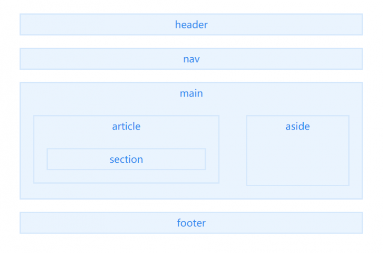

# HTML 的语义化

:::tip
优点

1. 易于用户阅读，样式丢失的时候能让页面呈现清晰的结构。
2. 有利于 SEO，搜索引擎根据标签来确定上下文和各个关键字的权重。
3. 方便其他设备解析，如盲人阅读器根据语义渲染网页
4. 有利于开发和维护，语义化更具可读性，代码更好维护，与 CSS3 关系更和谐。
   :::

## header

**定义文档或者文档的部分区域的页眉**，应作为介绍内容或者导航链接栏的容器。

> 在一个文档中，您可以定义多个 header 元素，但需要注意的是 header 元素不能作为 address 、 footer 或 header 元素的子元素。

## nav

**描述一个含有多个超链接的区域**，该区域包含跳转到其他页面或页面内部其他部分的链接列表。

> 在一个文档中，可定义多个 nav 元素。

## main

**定义文档的主要内容**，该内容在文档中应当是**独一无二
**的，不包含任何在文档中重复的内容，比如侧边栏，导航栏链接，版权信息，网站 logo，搜索框（除非搜索框作为文档的主要功能）。
需要注意的是在一个文档中不能出现多个 main 标签。

## article

article 元素表示文档、页面、应用或网站中的**独立结构**，**是可独立分配的、可复用的结构**，如在发布中，它可能是论坛帖子、杂志或新闻文章、博客、用户提交的评论、交互式组件，或者其他独立的内容项目。

## aside

aside 元素表示一个和**其余页面内容几乎无关的部分**，被认为是独立于该内容的一部分且可以被单独的拆分出来而**不会影响整体**。通常表现为侧边栏或嵌入内容。

## footer

footer 定义最近一个**章节内容或者根节点元素的页脚**。一个页脚通常包含该章节作者、版权数据或者与文档相关的链接等信息。
使用 footer 插入联系信息时，应在 footer 元素内使用 address 元素。
注意**不能包含 footer 或者 header**

## section

section 表示文档中的一个区域（或节），比如，**内容中的一个专题组**。
如果**元素内容可以分为几个部分的话，应该使用 article 而不是 section**。
不要把 section 元素作为一个普通的容器来使用，特别是当 section 仅仅是为了美化样式或方便脚本使用的时候，应使用 div。
