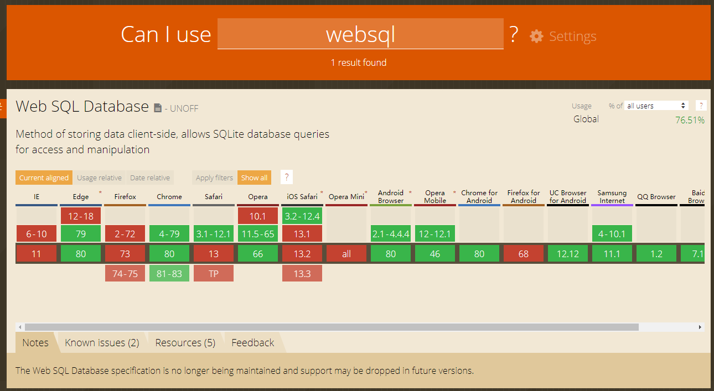
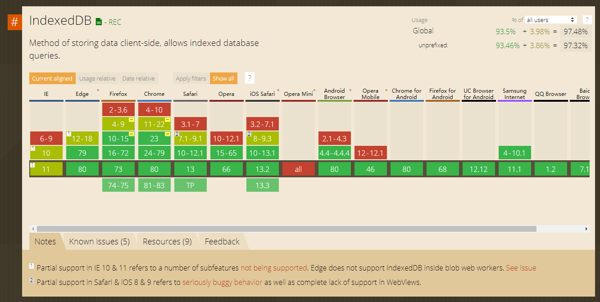

# web 的本地存储 (WebSQL , IndexedDB)

:::tip
cooki 和 localStorage 数据量较小, 所以诞生出另外一种解决方案: web 数据库
:::

## WebSql

作用于关系型数据库 , 使用 SQL 语句来进行操作

```javascript
const db = window.openDatabase(
  "db_test", // 数据库名称
  "1.0", // 数据库版本
  "这是一个我用来测试websql的数据库", // 简要描述
  2 * 1024 * 1024 // 大小  , 如果太大 浏览器会提示,如果用户拒绝 ,将抛出异常
);

 db.transaction(function(tx) {
     // 在 transaction 里面进行操作SQL 语句
     // 创建数据表  ..
      tx.executeSql(
          `CREATE TABLE IF NOT EXISTS user_info(userid primary key , username , password , createtime )`
      , [] , null )


     // 插入一条数据
      tx.executeSql(
        `INSERT INTO user_info VALUES(${user.userid} ,'${user.username}' , '${user.password}' , '${user.createtime}')`,
        [],
        // 执行成功的回调
        function(res) {
          console.log(res);
        },
        // 执行失败的回调
        function(tx, err) {
          console.log(err);
        }
      );


    // 查询
      tx.executeSql(` select * FROM user_info`,
        [],
        // 执行成功的回调
        function(tx, res) {
            // 使用 res.rows 取得 SQL语句查询出来的数据
          for (let index = 0; index < res.rows.length; index++) {
            const element = res.rows[index];
            console.log(element);
          }
        }
      );

 }
```

:::tip
优点:

1. 可以支持复杂查询 , 联表查询, 正则表达式查询 , 嵌套查询 , 还可以写独立的 SQL 脚本
2. 异步 , 不阻塞页面 (cookie , storage 为同步 )

缺点:

1. 不方便横向扩展 , 如果添加字段,但是数据量较多, 复杂性会很高
2. 海量数据使用 SQL 联查性能会很差
3. 为了保持事务一致性,难以应对高并发
4. 兼容性不咋好
   :::




## IndexedDB (Not Only Sql )

作用于非关系型数据库 , 大多采用事务, 以 key - value 的形式来进行操作 , 如 redis

```javascript
// 先打开数据库
const request = window.indexedDB.open("db_test", 6);
request.onerror = function(event) {
  // 打开数据库失败
};
let db = null;
request.onsuccess = function() {
  // 成功打开数据库
  db = request.result;
  console.log(`数据库打开成功`);
};
// 如果指定的版本号 > 数据库实际版本号
request.onupgradeneeded = function(event) {
  // 拿取到数据库的实例
  db = event.target.result;
  let objectStore = null;
  // db.objectStoreNames 可以获取此数据库的所有 对象仓库, 即所有表
  if (!db.objectStoreNames.contains("users")) {
    // 新建数据仓库  , 并且表示 主键为 userid
    objectStore = db.createObjectStore("users", { keyPath: "userid" });
    // 创建一个索引 , 并且 username 字段必须是 唯一的
    objectStore.createIndex("username", "username", { unique: false });
  }
};
```

### 新增

```javascript
// 采用事务的方式来进行操作, 因为都是异步的
function add() {
  const request = db
    .transaction(["users"], "readwrite")
    .objectStore("users")
    .add({ userid: 7, username: "aaaa", password: "123434643" });

  request.onsuccess = function() {
    console.log(`数据写入成功`);
  };

  request.onerror = function(err) {
    console.log(err.target);
    console.log(`数据写入失败`);
  };
}
```

### 读取

```javascript
function read() {
  const transaction = db.transaction(["users"]);
  const objectStore = transaction.objectStore("users");
  // 取得 key = 2  , 因为上面指定的key = userid , 那么get(2) 就 === userid === 2 的数据
  const request = objectStore.get(2);

  request.onerror = function(event) {
    console.log(`查询失败`);
  };

  request.onsuccess = function(event) {
    console.log(request.result);
  };
}
```

### 读取所有

```javascript
function readAll() {
  const objectStore = db.transaction("users").objectStore("users");
  objectStore.openCursor().onsuccess = function(event) {
    // 使用指针
    const cursor = event.target.result;
    if (cursor) {
      console.log(cursor.key);
      console.log(cursor.value.userid);
      console.log(cursor.value.username);
      console.log(cursor.value.password);
      // 切换到下一个指针
      cursor.continue();
    } else {
      console.log("没有更多数据了!!!");
    }
  };
}
```

### 修改

```javascript
function put() {
  const request = db
    .transaction(["users"], "readwrite")
    .objectStore("users")
    .put({ userid: 2, username: "张三", password: "1011" });

  request.onerror = function() {
    console.log(`数据更新失败 `);
  };
  request.onsuccess = function() {
    console.log(`数据更新成功`);
  };
}
```

### 删除

```javascript
function remove() {
  const request = db
    .transaction(["users"], "readwrite")
    .objectStore("users")
    .delete(5);

  request.onsuccess = function() {
    console.log("数据删除成功");
  };
  request.onerror = function() {
    console.log("数据删除失败");
  };
}
```

### 根据索引查找

```javascript
function findByIndex() {
  const objectStore = db.transaction("users").objectStore("users");
  // 根据 索引名字为 username  的索引进行查找
  const request = objectStore.index("username").get("julayr");
  // 只能搜索第一条
  request.onsuccess = function(event) {
    const res = event.target.result;
    console.log(res);
  };
}
// 查找多个, 利用 IDBKeyRange + 指针
function findByIndexAll() {
  const objectStore = db.transaction("users").objectStore("users");
  const index = objectStore.index("username");
  const keyRange = IDBKeyRange.only("julayr");
  index.openCursor(keyRange).onsuccess = function(event) {
    const cursor = event.target.result;
    if (cursor) {
      console.log(cursor.value.password);
      cursor.continue();
    }
  };
}
```

怎么说呢 太复杂了 ...
但是兼容性很好

